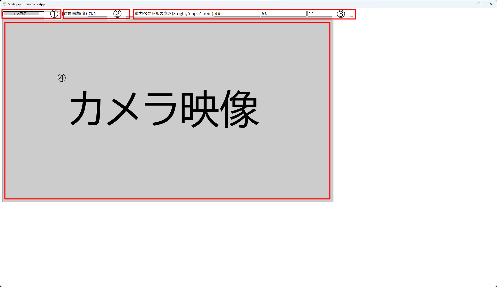
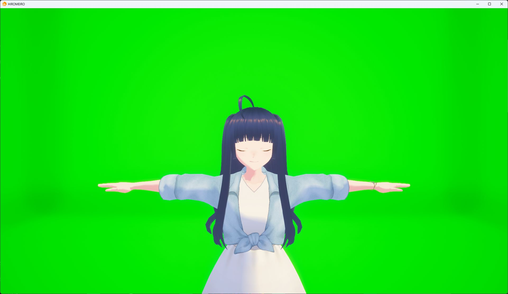
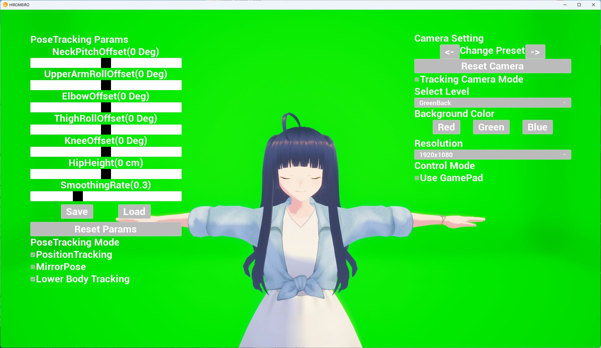
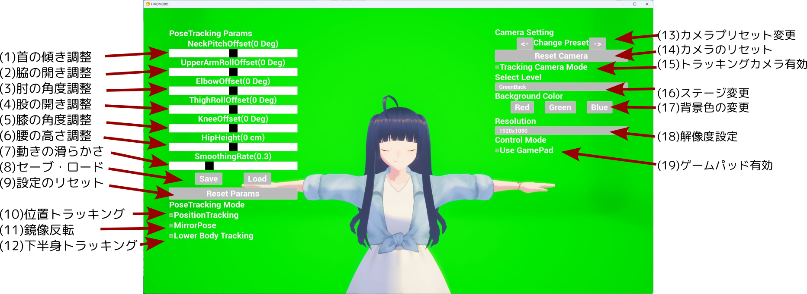

HIROMEIROクイックスタート
#########################

本文書では、HIROMEIROの基本的な使用方法について説明いたします。

HIROMEIROについて
*****************

HIROMEIROは、お手持ちのVRMファイルを使用して、
トラッキングデバイスを用いることなくフルトラッキングを行うことができるソフトウェアです。
トラッキング用ソフトウェアと表示用ソフトウェアの連携により動作します。

HIROMEIROの読みは「ひろめいろ」です。アクセントは平板です。

HIROMEIROでできること
=====================

- トラッキングデバイスなし、カメラ一台のみでのフルトラッキング
- 上半身モードでのハンドトラッキング
- VRMファイル読み込み

動作環境
========

表示用の本体ソフトウェアにはWindows PCが必要です。
トラッキングソフトウェアにはWindows PC,AndroidもしくはPythonが動作するPC環境のいずれかが必要です。
またPCでトラッキングを行う場合は別途カメラを用意してください。

弊社テスト環境は以下です。

- デスクトップPC

    - Windows 11
    - AMD Ryzen 7 5700X
    - 32GBメモリ
    - NVidia GeForce RTX 4060 Ti (16GB)

- PC用Webカメラ

    - Logicool C920n

(参考)トラッキング用ソフトウェアは以下の環境でも動作確認をしています。

- Python用トラッキングソフトウェア

    - Ubuntu 24.04

- Androidスマートフォン

    - Sony Xperia 1 IV
    - Samsung Galaxy S26

ソフトウェアの動作にはゲームパッドの利用を推奨します。

フルトラッキングを行う場合はカメラに全身が写ることが前提となっています。
機種にもよりますが、おおよそ2m x 2m程度の広さを確保してください。

本体ソフトウェアのインストール
******************************

インストールは不要です。
releasesから最新のzipファイルを入手し、解凍してください。

https://github.com/947dTech/HIROMEIRO/releases

実行方法
********

事前準備
========

HIROMEIROとトラッキング用ソフトウェアを同じPCで実行する場合は
次の項目へ進んでください。

HIROMEIROを実行するPCとトラッキング用ソフトウェアを実行する端末が異なる場合、
同じネットワークに存在することを確認してください。

次に、PC側のIPアドレスを確認してください。

コントロールパネル→ネットワーク接続→接続しているデバイス→詳細→IPv4アドレス

各トラッキング用ソフトウェアには
共通項目として、送信先IPアドレスを入力する箇所があるので
PC側のアドレスを入力して下さい。

トラッキング用ソフトウェア
==========================

同梱のWindows用ソフトウェアの例を記載します。

mediapipe_transceiver_appの中のexeファイルから起動してください。

起動すると次の画面が表示されます。

.. image:: images/tracking/screen_00.png
    :alt: 起動時の画面

①に送信先IPアドレスとポート番号を入力してください。
同じマシン内で送信する場合はそのまま(127.0.0.1:38013)にしてください。
異なるマシンへ送信する場合はIPアドレスを書き換えてください。
HIROMEIROではポート番号は38013(0x947d)を使用します。

②Initボタンを押すと認識画面に遷移します。

認識画面を開いた初回ではカメラへのアクセスを許可する必要があります。
ダイアログから許可を行ってください。

①のドロップダウンメニューから使用するカメラを選択してください。

②のプライバシーモードのチェックボックスは
チェックされている場合は入力映像を隠すようになります。
デフォルトでチェックされているため、入力映像を確認したい場合はチェックを外してください。

③には、カメラの対角画角を入力します。
使用するカメラのカタログスペックから引用して下さい。

④には、カメラの向きを指定する重力ベクトルを入力します。
座標系はX-right Y-up Z-frontで、
重力ベクトルは鉛直上向きとなります。

- カメラ映像の下が床方向を向いている場合、重力ベクトルは(0, 9.8, 0)となります。
- カメラ映像の左を床方向に向けた場合、重力ベクトルは(9.8, 0, 0)となります。

⑤に認識結果を表示します。
②のプライバシーモードのチェックが外れていると入力映像が表示されますので、
配信画面に映りこまないよう十分に注意してください。

HIROMEIRO (本体ソフトウェア)
============================

Windowsディレクトリの中に入り、HIROMEIRO.exeを起動してください。
初回起動時のみネットワーク接続の許可ダイアログが出ますので、
接続を許可してください。

トラッキングソフトが動いている場合、数秒立つとモデルが動き始めます。
モデルが吹き飛んだ場合、ゲームパッドの左スペシャルボタンもしくはRキーを押すと現在位置をリセットできます。

HIROMEIROの操作方法
*******************

基本的な操作
============

本ソフトウェアではフォーカスがあたっているときのみキーボード操作を受け付けます。
ゲームパッドはフォーカスの有無にかかわらず操作を受け付けます。
フォーカスがあたっている間はマウスカーソルが外に出ないため、
他のソフトウェアの操作の際には
Alt+Tabキーでフォーカスを切り替えてください。

起動時の画面を以下に示します。

マウスで以下の操作を行うことができます。

- マウスホイールでカメラのズームイン・アウトを行うことができます。
- ホイールボタンのドラッグでカメラの上下左右移動を行うことができます。
- 右ボタンドラッグでキャラクターの向きを回転させることができます。

また、ゲームパッドもしくはキーパッドで以下の操作を行うことができます。

- 各方向ボタンもしくはWASDキーをおすと、カメラの前後左右移動を行うことができます。
- 左右のショルダーボタンもしくはQ/Eキーをおすと、後述の設定ファイルで指定したカメラプリセットを切り替えることができます。
- 左スペシャルボタンもしくはRキーをおすと、現実空間における現在のスマホ側カメラに対する自分の位置に基づいて表示されているモデルの位置をリセットします。

ゲームパッドの右スペシャルボタンもしくはMキーをおすと、
下図のように設定メニューが開きます。
開いている状態でもう一度押すと閉じます。

メニュー操作
============

メニュー画面の各部の説明は以下のようになっています。

関節角度調整用パラメーター
--------------------------

(1)-(5)までのスライダーで各関節角度を調整できます。
(2)UpperArmから(5)Kneeまでの各オフセットは10度程度あたえると自然な姿勢になります。

(6)で腰の高さを調整できます。足が床に埋まる場合は上げてください。

(7)Smoothing Rateは動きをなめらかにするための係数です。デフォルトは0.3です。
最小値は0.1で、小さいほどなめらかになりますが、速い動きへの反応が悪くなります。
最大値は1.0で、最高速度で動作を反映しますが動きが振動します。
カメラがよっているときは0.1程度の値を、
カメラが引いているときは0.3程度の値を設定することを推奨します。

(8)は(1)-(7)の設定値のセーブ・ロードを行います。
Saveを押すと現在の設定をセーブします。
Loadを押すとセーブした設定を再読込します。
セーブファイルはひとつだけです。

(9)のボタンをおすと設定値をすべてデフォルトにリセットします。
セーブファイルはリセットされないため、
間違ってリセットした場合は(8)のLoadを押してください。
リセットしたものをセーブする場合は(8)のSaveを押してください。

トラッキングモードの設定
------------------------

(10)位置トラッキングのチェックボックスを外すと、
腰位置のトラッキングを行わないモードに移行します。
このモードは上半身のみモードで
位置推定がうまく行かない場合にご利用ください。

(11)鏡像反転のチェックボックスを有効にすると
姿勢をすべて左右方向に反転します。
スマホのインカメラは鏡像となっているため、チェックすることで
本来のご自身の動きを反映したものになります。

(12)下半身トラッキングのチェックボックスを外すと、
上半身のみトラッキングモードに移行します。
上半身のみトラッキングモードでは
顔と肩の角度、両手の位置を用いてトラッキングを行います。
椅子に座った姿勢など上半身だけを動かす必要がある場合、
カメラの画角に全身が映りきらない場合にご利用ください。

カメラ設定
----------

(13)の左右ボタンで
後述の設定ファイルで指定したカメラのプリセットの切り替えができます。

(14)のボタンを押すとマウス等で操作したカメラの設定と
キャラクターの向きをリセットします。

(15)のチェックボックスを有効にすると
カメラは追従モードとなり、
キャラクターの腰の位置(VRMのRootボーン)に遅れて追従するようになります。
右ボタンドラッグで指定したキャラクターの向きにも追従するようになります。

ステージ変更
------------

(16)のプルダウンメニューはレベルを選択することができます。
GreenBack(グリーンバック),
FountainPark(公園),
GymStudio(屋内ジム)から選択できます。

GreenBackを指定している場合は
(17)背景色の変更ボタンを押すと、各色に背景を変更することができます。
緑色が使われているモデルなど、
グリーンバックで色が抜けない場合にご利用ください。

解像度設定
----------

(18)のプルダウンメニューから解像度を選ぶことができます。
デフォルトは1920x1080です(起動時に上書きします)。
1280x720(解像度の小さなディスプレイ向け)を選択できます。

ゲームパッドの有効状態
----------------------

(19)のチェックボックスを外すと、ゲームパッドを無効化します。
HIROMEIROはフォーカスが外れている場合にもゲームパッド入力を受け付けるため、
ゲーム実況などゲームパッドを他の用途に使う場合はチェックを外してください。
この状態でもキーボード操作とマウス操作はフォーカスを当てれば有効です。

VRMファイルの適用について
=========================

お手持ちのVRMファイルをドラッグアンドドロップしてください。
しばらくするとモデルが切り替わります。

終了操作
========

フォーカスが外れている状態でクローズボタンもしくは
フォーカスがあたっている状態でAlt+F4で終了できます。

設定ファイルについて
********************

HIROMEIROConfig.jsonというファイルが同梱されています。
このファイルには以下の設定項目を書き込むことができます。
困ったときはファイルの初期設定を参考にしてください

VRMモデルの自動ロード
=====================

``"vrm_files"`` というキーにVRMモデルのパスのリストを記述します。
最初の項目が起動時に読み込まれます。
読み込みに時間がかかるため、最初にデフォルトモデルが表示されてしばらくするとモデルが切り替わります。

ファイルの相対パスを指定する場合は、
HIROMEIROのディレクトリを ``../../../../`` とすることに注意してください。

カメラ設定
==========

``"camera_setting_params"`` というキーにカメラ設定のリストを記述します。

- position : カメラの位置を設定します。単位はcmです。

    - x : モデルに対する左右の位置。
    - y : モデルからの距離。
    - z : モデルの腰座標からの高さ。

- rotation : カメラの傾きを設定します。単位は度です。

    - roll : 視線軸まわりの回転。90度に設定するとカメラが横倒しになります。縦型配信の際は90度に設定してください。
    - pitch : 横方向の角度。
    - yaw : 縦方向の角度。-90度に設定するとちょうどモデルのほうをカメラが向きます。

- focal : カメラの視野角を設定します。単位は度です。
