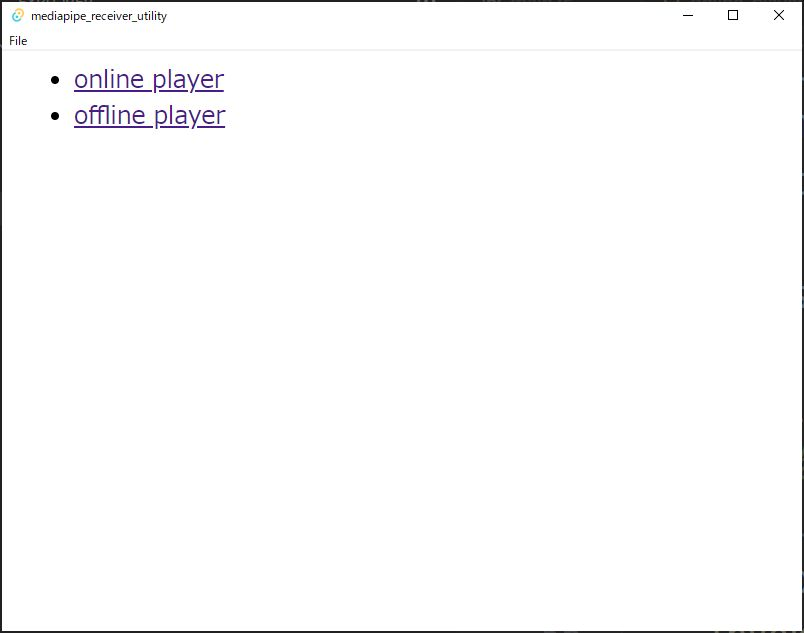
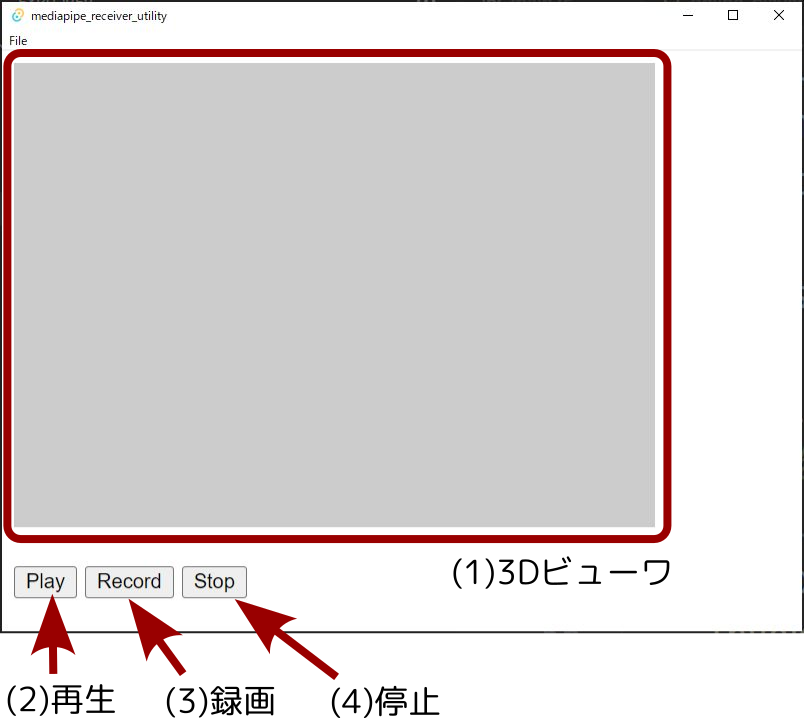
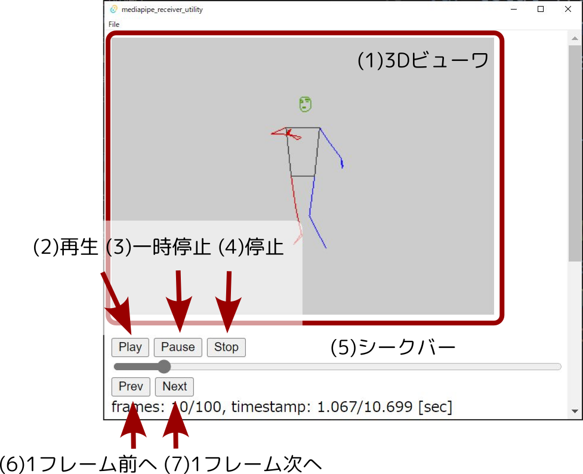

レコーディング用ソフトウェアについて
####################################

動作のレコーディングやトラッキング結果の表示を行うためのツール
mediapipe_receiver_utilityを同梱しています。

使い方
******

起動すると、
online playerとoffline playerを選択する画面になります。
クリックでどちらかを選択してください。

Online Player
=============

オンラインモードではトラッキングアプリから送信されてきた
データの表示、保存を行います。
あらかじめアプリを起動し、
送信先IPアドレスを
本アプリケーションを起動しているPCに設定してください。

(1) 3Dビューワには認識結果を3Dで表示します。
ドラッグで角度を変更することができます。

(2) Playボタンを押すとUDPで送られてきた
mediapipeの認識結果を表示します。

(3) Recordボタンを押すと
保存先のファイルを選択するダイアログが開きます。
ファイルを指定すると、
Playボタン同様に認識結果を表示し、
指定されたファイルに保存していきます。

(4) Stopボタンを押すと
Play/Record状態を停止します。
Play/Recordはどちらか一方のみが動作します。
切り替える場合は一度Stopを押してください。

選択画面に戻るには
Back to Menuボタンを押してください。

Offline Player
==============

オフラインモードでは
オンラインモードで保存したデータを再生します。
まずメニューからFile->Openを選択してください。
保存されたファイルを選択するダイアログが開きます。
ファイルを選択して読み込んでください。

(1) 3Dビューワには認識結果を3Dで表示します。
ドラッグで角度を変更することができます。

ファイルを読み込んだ後、
(2) Playボタンを押すとデータを再生します。
再生中はローカルホストに向けてUDP送信を行います。
HIROMEIROを起動しておくと再生中のデータが反映されます。

再生中に(3) Pause / (4) Stopボタンを押すと停止します。
PauseとStopの違いは、
Pauseを押した場合その場で停止し、
次にPlayを押すと再開されます。
Stopを押した場合は先頭に戻り、
次にPlayを押すと先頭から再生されます。

停止した状態で
(5)シークバーを動かすと指定のフレームに移動できます。
(6) Prev / (7) Nextボタンを押すと
1フレームずつ移動することができます。
停止している状態ではUDP送信はおこなわれません。

選択画面に戻るには
Back to Menuボタンを押してください。
