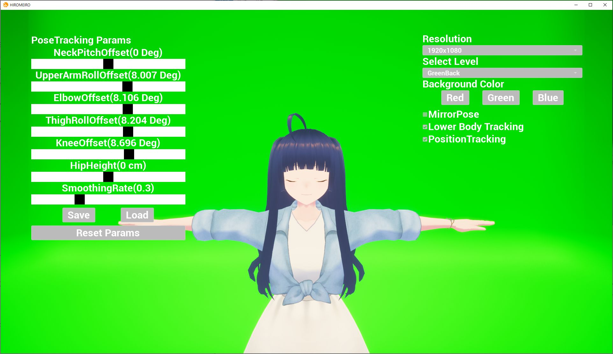
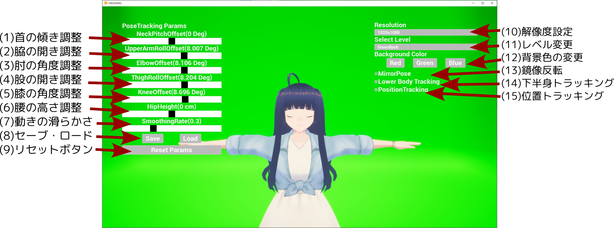

# HIROMEIRO取扱説明書

- 著者: 矢口 裕明 (クシナダ機巧株式会社)

## 本文書について

本文書では、HIROMEIROの使用方法について説明いたします。

## HIROMEIROについて

HIROMEIROは、お手持ちのVRMファイルを使用して、
トラッキングデバイスを用いることなくフルトラッキングを行うことができるソフトウェアです。
AndroidスマートフォンアプリとPCアプリの連携により動作します。

HIROMEIROの読みは「ひろめいろ」です。アクセントは平板です。

### 動作環境

Windows PCとAndroidスマートフォンが必要です。

弊社テスト環境は以下です。
- Lenovo Thinkpad P53
    - Windows 10
    - Intel Core i7 9750H
    - NVidia Quadro T2000
- Sony Xperia 1 IV

Androidスマートフォンは以下の機種で動作確認済みです。

- Sony Xperia 1 IV
- Google Pixel 5

ソフトウェアの動作にはゲームパッドの利用を推奨します。

スマホのインカメラに全身がうつることが前提となっています。
機種にもよりますが、おおよそ2m x 2m程度の広さを確保してください。


## インストール方法

### ダウンロード

releasesから最新のzipファイルを入手し、解凍してください。

https://github.com/947dTech/HIROMEIRO/releases


### 本体ソフトウェアのインストール

インストールは不要です。


### Android apk (mediapipe/holistictrackinggpu) のインストール

以下のどちらかの方法でインストールを行ってください。

#### ファイルからインストール

まず、お手持ちのAndroid端末のインストール設定を許可してください。

設定->アプリ->特別なアプリアクセス->不明なアプリのインストール

を選択し、インストールされているファイルビューワを選択してください。

次に端末をPCに接続し、同梱の`holistictrackinggpu.apk`を端末にコピーします。

コピーしたファイルをファイルビューワから選択し、インストールしてください。


#### 開発者向け:ビルドしてインストール

以下の操作はDockerが動くUbuntu端末を推奨します。

改造版mediapipeのソースコードを入手してください。
https://github.com/947dTech/mediapipe

`holistic_v089_release`というブランチに切り替えてください。

mediapipe環境の構築はDockerの利用を推奨します。

https://google.github.io/mediapipe/getting_started/install.html#installing-using-docker

Androidビルド環境の構築は公式ドキュメントを参照してください。

https://google.github.io/mediapipe/getting_started/android.html

Android appのビルドは以下のコマンドでできます。

```
$ bazelisk build -c opt --config=android_arm64 --linkopt="-s" mediapipe/examples/android/src/java/com/google/mediapipe/apps/holistictrackinggpu:holistictrackinggpu
```

インストールは実機をadbで認識させた上で、以下の方法でできます。

```
$ adb install bazel-bin/mediapipe/examples/android/src/java/com/google/mediapipe/apps/holistictrackinggpu/holistictrackinggpu.apk
```


## 実行方法

### 事前準備

PCとAndroid端末が同じネットワークに存在することを確認してください。

次に、PC側のIPアドレスを確認してください。

コントロールパネル->ネットワーク接続->接続しているデバイス->詳細->IPv4アドレス


### holistictrackinggpu (Android)

実行し、画面に映像がうつること、人物の骨格構造が認識されることを確認してください。
環境によっては起動に時間がかかることがあります。

実行できたら、右上のメニューからSettingを開き、
先程のIPアドレスを入力します。


### HIROMEIRO (本体ソフトウェア)

Windowsディレクトリの中に入り、HIROMEIRO.exeを起動してください。

holistictrackinggpuが動いている場合、数秒立つとモデルが動き始めます。
モデルが吹き飛んだ場合、ゲームパッドの左スペシャルボタンもしくはRキーを押すと現在位置をリセットできます。


## 操作方法

### 基本的な操作

本ソフトウェアではフォーカスがあたっているときのみキーボード操作を受け付けます。
ゲームパッドはフォーカスの有無にかかわらず操作を受け付けます。
フォーカスがあたっている間はマウスカーソルが外に出ないため、
他のソフトウェアの操作の際には
Alt+Tabキーでフォーカスを切り替えてください。

起動時の画面を以下に示します。


マウスで以下の操作を行うことができます。

マウスホイールでカメラのズームイン・アウトを行うことができます。

ホイールボタンのドラッグでカメラの上下左右移動を行うことができます。

また、ゲームパッドもしくはキーパッドで以下の操作を行うことができます。

各方向ボタンもしくはWASDキーをおすと、
カメラの前後左右移動を行うことができます。

左右のショルダーボタンもしくはQ/Eキーをおすと、
カメラプリセットを切り替えることができます。

左スペシャルボタンもしくはRキーをおすと、
現在のカメラに対する自分の位置に基づいてモデルの位置をリセットします。

右スペシャルボタンもしくはMキーをおすと、
下図のように設定メニューが開きます。
開いている状態でもう一度押すと閉じます。




### メニュー操作

メニュー画面の各部の説明は以下のようになっています。




(1)-(5)までのスライダーで各関節角度を調整できます。
(2)UpperArmから(5)Kneeまでの各オフセットは10度程度あたえると自然な姿勢になります。

(6)で腰の高さを調整できます。足が床に埋まる場合は上げてください。

(7)Smoothing Rateは動きをなめらかにするための係数です。デフォルトは0.3です。
小さいほどなめらかになりますが、速い動きへの反応が悪くなります。
カメラがよっているときは0.1程度の値を、
カメラが引いているときは0.3程度の値を設定することを推奨します。

(8)は(1)-(7)の設定値のセーブ・ロードを行います。
Saveを押すと現在の設定をセーブします。
Loadを押すとセーブした設定を再読込します。
セーブファイルはひとつだけです。

(9)のボタンをおすと設定値をすべてデフォルトにリセットします。

(10)のプルダウンメニューから解像度を選ぶことができます。
デフォルトは1920x1080です(起動時に上書きします)。
1080x1920(ショート動画用)を選択できます。


### VRMファイルの適用について

お手持ちのVRMファイルをドラッグアンドドロップしてください。
しばらくするとモデルが切り替わります。


### 終了操作

フォーカスが外れている状態でクローズボタンもしくは
フォーカスがあたっている状態でAlt+F4で終了できます。
